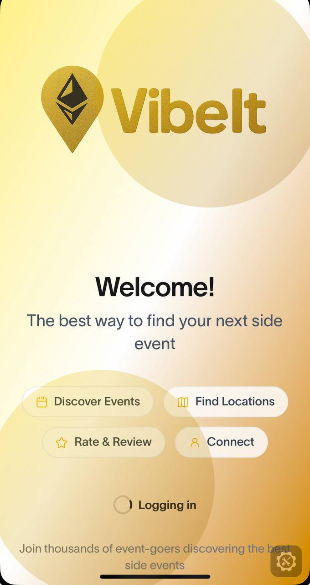

# 🌐 Worldcoin ETHCC Events Mini App — Social Reputation via Hypergraph

We built a **Worldcoin Mini App** that transforms ETHCC side events into a **frictionless social layer** inside the **World App**.

> 🧠 Human-verified feedback. 📊 Event insights. 🧭 No wallets or logins needed.

---

## 🎯 What it does

This Mini App scrapes **ETHCC side events from Luma** and lets World App users:

- ✅ **Mark attendance**
- 💬 **Comment** on events
- ⭐️ **Rate** them with a score

All interactions are stored and modeled using **The Graph's Knowledge Graph**, creating a structured, composable data layer of:

- Who attended what
- What users thought (comment & score)
- How events trend within the community

This enables **portable, Sybil-resistant reputation** for events and attendees — right from the **World App**.

---

## ⚙️ Tech Stack

- **🌀 Worldcoin Mini App SDK** — identity & UI inside World App
- **📡 Hypergraph (GRC-20)** — semantic data modeling via The Graph
- **💻 Next.js + Tailwind** — frontend
- **🗃 IPFS + Smart Account (Geo)** — data publication & signing

---

## 🚀 Why it matters

- **No wallets or logins** — built directly into World App UX
- **Sybil-resistant** — every interaction is verified with World ID
- **Composability** — all reviews and relationships are open & queryable
- **Community value** — understand event quality via real human feedback

This is the **first layer of portable reputation for IRL events**, verified by Worldcoin and stored in The Graph for anyone to build on top.

---

## 🧪 Example Use Case

> _"Which ETHCC side events are most loved by real attendees?"_  
> _"How does attendance correlate with DAO contributors?"_

Thanks to The Graph's semantic structure, these questions are answerable out-of-the-box via simple queries.

---

## 📸 Screenshots / Demo



---

## 🚀 Running the Demo

### Prerequisites

- Node.js 18+ installed
- [ngrok](https://ngrok.com/) account and CLI tool
- [Worldcoin Developer Portal](https://developer.worldcoin.org) account

### Setup Instructions

1. **Clone and navigate to the project**
   ```bash
   cd vibe-it/world-miniapp
   ```

2. **Install dependencies**
   ```bash
   npm install
   ```

3. **Set up environment variables**
   Create a `.env.local` file with the following variables:
   ```bash
   # Required for NextAuth
   NEXTAUTH_SECRET=your-secret-key-here
   AUTH_SECRET=your-secret-key-here
   
   # Required for World ID integration
   NEXT_PUBLIC_APP_ID=app_your_app_id_here
   
   # Required for wallet authentication
   HMAC_SECRET_KEY=your-hmac-secret-key
   
   # Backend URL (if using the backend)
   NEXT_PUBLIC_BACKEND_URL=http://localhost:8000
   
   # Environment setting
   NEXT_PUBLIC_APP_ENV=development
   ```

4. **Generate authentication secret**
   ```bash
   npx auth secret
   ```
   Copy the generated secret to your `.env.local` file as `AUTH_SECRET`

5. **Start the development server**
   ```bash
   npm run dev
   ```

6. **Set up ngrok tunnel**
   In a separate terminal, run:
   ```bash
   ngrok http 3000
   ```
   
   Note the HTTPS URL provided by ngrok (e.g., `https://abc123.ngrok-free.app`)

7. **Update configuration for ngrok**
   - Add your ngrok URL to the `AUTH_URL` in `.env.local`:
     ```bash
     AUTH_URL=https://abc123.ngrok-free.app
     ```
   
   - Update `next.config.ts` to include your ngrok domain in `allowedDevOrigins`:
     ```typescript
     const nextConfig = {
       // ... other config
       allowedDevOrigins: ['https://abc123.ngrok-free.app']
     }
     ```

8. **Configure in Worldcoin Developer Portal**
   - Go to [developer.worldcoin.org](https://developer.worldcoin.org)
   - Create or select your app
   - Update the app's URL to your ngrok HTTPS URL
   - Note your `app_id` and add it to your `.env.local`

9. **Test the Mini App**
   - Open World App on your phone
   - Navigate to the mini app using your ngrok URL
   - Or use the [Worldcoin Simulator](https://simulator.worldcoin.org) for testing

### Development Notes

- The app uses **Eruda** for mobile debugging (disabled in production)
- Hot reloading is enabled for development
- Use the World App or Worldcoin Simulator to test World ID verification
- Check the console logs in Eruda for debugging on mobile

### Troubleshooting

- If ngrok URL changes, update both `.env.local` and `next.config.ts`
- Ensure your Worldcoin Developer Portal app is configured for the correct environment
- Check that all environment variables are properly set
- Verify that the World App can access your ngrok URL

---

## 🧠 Learn More

- [Worldcoin Developer Docs](https://docs.worldcoin.org)
- [The Graph Knowledge Graph](https://thegraph.com/blog/introducing-the-knowledge-graph)
- [Hypergraph SDK (grc-20)](https://github.com/graphprotocol/hypergraph)

---

## 👥 Team

Built at ETHGlobal Cannes with love <3
